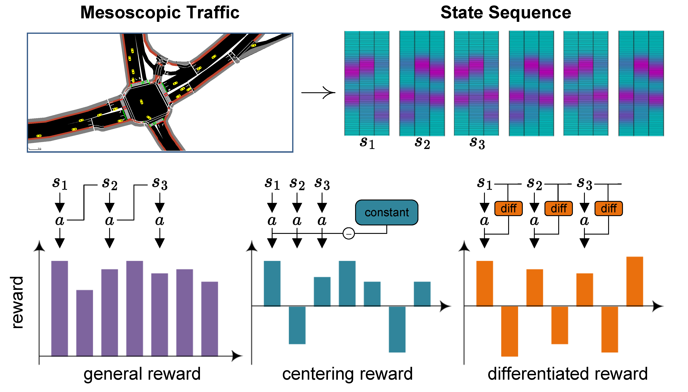

# READ ME

> *Source code for paper "A Differentiated Reward Method for Reinforcement Learning Based Multi-Vehicle Cooperative Decision-Making Algorithms"*


<p align="center">
  
</p>

## 🚀 Getting Started

1. Clone this repository

2. Install dependencies:
   ```bash
   pip install -r requirements.txt
   ```

3. Set up LLM in [`utils/call_llm.py`](./utils/call_llm.py) by providing credentials. By default, you can use the AI Studio key with this client for Gemini Pro 2.5:

   ```python
   client = genai.Client(
     api_key=os.getenv("GEMINI_API_KEY", "your-api_key"),
   )
   ```

   You can use your own models. We highly recommend the latest models with thinking capabilities (Claude 3.7 with thinking, O1). You can verify that it is correctly set up by running:
   ```bash
   python utils/call_llm.py
   ```

4. Generate a complete codebase tutorial by running the main script:
    ```bash
    # Analyze a GitHub repository
    python main.py --repo https://github.com/username/repo --include "*.py" "*.js" --exclude "tests/*" --max-size 50000

    # Or, analyze a local directory
    python main.py --dir /path/to/your/codebase --include "*.py" --exclude "*test*"

    # Or, generate a tutorial in Chinese
    python main.py --repo https://github.com/username/repo --language "Chinese"
    ```

    - `--repo` or `--dir` - Specify either a GitHub repo URL or a local directory path (required, mutually exclusive)
    - `-n, --name` - Project name (optional, derived from URL/directory if omitted)
    - `-t, --token` - GitHub token (or set GITHUB_TOKEN environment variable)
    - `-o, --output` - Output directory (default: ./output)
    - `-i, --include` - Files to include (e.g., "*.py" "*.js")
    - `-e, --exclude` - Files to exclude (e.g., "tests/*" "docs/*")
    - `-s, --max-size` - Maximum file size in bytes (default: 100KB)
    - `--language` - Language for the generated tutorial (default: "english")
